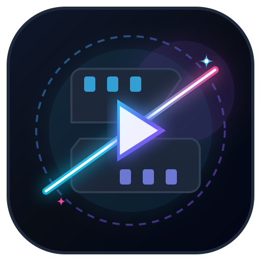

# CineCut AI — Turbo FFmpeg Video Clipper, 9:16 Reframer & Google Drive Cloud Pipeline

<p align="center">
  
</p>

<p align="center">
  <strong>Cut long movies, podcasts, and recordings into viral 9:16 Shorts &amp; Reels in seconds.</strong><br>
  Powered by an autonomous <strong>6x Parallel Turbo FFmpeg Backend</strong> + <strong>1080p Master Canvas Engine</strong>, complete with background execution, zero frame drops, and a full <strong>Google Drive From Folder ➔ To Folder</strong> cloud pipeline.
</p>

<p align="center">
  
  
  
  
  
  
  
  
</p>

---

## 📖 Overview

**CineCut AI** is a full-stack studio web application built to repurpose long-form videos, movies, podcasts, and streams into short-form vertical clips for **YouTube Shorts, TikTok, Instagram Reels, and Facebook Stories**.

CineCut AI features a **Dual-Engine Video Processing Architecture**:
1. **⚡ Turbo FFmpeg Backend Engine (`MP4` — Default)**:
   - Uses a multi-core Node.js + **FFmpeg / FFprobe** server pipeline with **instant background source pre-staging** (`0ms` start delay when you click Cut).
   - Runs **up to 6x parallel FFmpeg workers** in a **detached background job queue** (`/api/video/jobs`) that continues cutting clips and uploading them directly to your Google Drive **even if you minimize the app, lock your phone, or close the browser tab**.
   - Guarantees **zero frame drops** (`-vsync cfr`), crisp **Smart HD / 1080p** visual quality, or **100% Bitstream Copy (`-c copy`)** for untouched original stream slicing.
2. **🎨 Master HTML5 Canvas Engine (`WebM`)**:
   - Runs 1080p 60fps hardware-accelerated canvas compositing (`16 Mbps` video / `256 kbps` Web Audio) directly in the browser with an **anti-throttling background timer** so hidden tabs never freeze or drop frames.

---

## ✨ Key Features

### 1. ⚡ Ultra-Fast Turbo FFmpeg Backend & Detached Background Execution
- **Instant Background Source Pre-Staging**: As soon as you select or drop a video, CineCut AI pre-stages the source file into the server cache in the background so slicing starts immediately on click.
- **Autonomous Background Jobs (`/api/video/jobs`)**: Slicing and Google Drive uploads run independently on the server with on-disk state persistence (`jobs_state.json`). If you close or refresh the tab and come back later, the app automatically reconnects and restores live progress.
- **36x Faster Ambient Blur Pipeline**: Uses a specialized downscale-blur-upscale FFmpeg filter graph (`fast_bilinear` + `boxblur` + `bicubic` foreground) that cuts blur CPU time by ~97% while maintaining a rich Gaussian backdrop.
- **Master Lossless & 100% Bitstream Copy Modes**:
  - **Master Lossless HD (`CRF / CFR Locked`)**: Reframes to 9:16, 16:9, or 1:1 with ambient blur, sequential Part badges, and locked source frame rate.
  - **100% Bitstream Copy (`-c copy`)**: Slices original video/audio packets directly without re-encoding for `0%` quality loss and sub-second cutting.

### 2. ☁️ Google Drive "From Folder ➔ To Folder" Cloud Pipeline
- **Full Google Drive Access (`drive` scope)**: Authenticate via Google Identity Services (GIS) OAuth 2.0 & Firebase Auth to browse your entire Google Drive, including **My Drive**, **Nested Subfolders**, and **Shared with Me**.
- **1. From Folder (Source Video Picker)**:
  - Pick any folder in your Google Drive as your **From Folder**, search across all folders, or **paste any Google Drive Folder Link / ID** directly.
  - Browse and load source videos straight from Google Drive into the studio.
- **2. To Folder (Automated Cloud Destination)**:
  - Select any existing Google Drive folder, create a new folder on the fly, or auto-create a custom destination folder (defaults to `CineCut_Clips`).
  - Decoupled server-side multipart uploads send finished `.MP4` clips directly to your **To Folder** in parallel while FFmpeg workers immediately slice the next clip.

### 3. 📊 Source Video Monitor with Live Length & File Size Detection
- **Automatic Metadata Probing**: Immediately upon uploading or selecting a video, the **Source Video Monitor** displays both the exact **Video Length** (`MM:SS` / `HH:MM:SS`) and **Video File Size** (`KB` / `MB` / `GB`) in the header and player metadata bar.
- **1-Click Interactive Demo**: Includes a bundled 93-second video (`/demo.mp4`) so you can test the entire slicing, reframing, and preview workflow in one click.

### 4. ✂️ Flexible Cut Modes & Interactive Clip Timeline
- **Fixed Duration Mode**: Slice videos into uniform intervals (`15s`, `30s`, `60s Shorts`, `90s`, `2 min`, `3 min`, `5 min`, or any custom second duration).
- **Equal Parts Mode**: Divide any video evenly into $N$ equal parts ($2$ to $50$ clips).
- **Custom Ranges & Timeline Editor**:
  - Inspect all calculated clips on the color-coded **Interactive Clip Timeline** (showing total video length and byte size).
  - Fine-tune exact **Start** and **End** timestamps (`mm:ss` or seconds), nudge boundaries with `-1s` / `+1s` precision buttons, **Split** any clip in half at its midpoint, or **Add / Delete** segments.

### 5. 📱 Social Canvas Reframing & Sequential Part Badges
- **Aspect Ratio Presets**:
  - **9:16 Vertical**: Built for YouTube Shorts, TikTok, and Instagram Reels with **Ambient Blur Fill**.
  - **16:9 Landscape**: Widescreen format for YouTube and standard players.
  - **1:1 Square**: Optimized for Instagram and LinkedIn feed posts.
- **Sequential Part Badges**: Automatically stamps `PART 1`, `PART 2`, `PART 3` banners or custom top/bottom hook text onto every clip.

### 6. 🎬 Live Clip Progress & Embedded Cut Video Player Gallery
- **Real-Time Progress Telemetry**:
  - Watch live source upload/staging progress (`Staging X%`), an animated **Overall Batch Progress Bar (`0% ➔ 100%`)**, and individual clip progress bars (`Cutting X%` ➔ `Drive X%` ➔ `Ready 100%` / `Synced 100%`) with output file size, resolution, FPS, and encode time.
- **Cut Video Clips Showcase Gallery**:
  - As soon as a clip finishes cutting, it is automatically pre-fetched into browser `Blob` memory and displayed in an embedded **Cut Video Clips — Ready to Play & Download** gallery.
  - Watch every cut clip directly on the page, open the **Fullscreen Preview Modal**, download individual `.MP4` files with a single click, or bundle all clips into a `.ZIP` archive.

---

## 🏗️ Architecture & Technology Stack

```
┌──────────────────────────────────────────────────────────────────────────┐
│                            CineCut AI Studio                             │
├────────────────────────────┬─────────────────────────────────────────────┤
│ Application Framework      │ Next.js 15.5 (App Router, Node.js Runtime)  │
│ Frontend UI                │ React 19.2 + TypeScript 5.9                 │
│ Styling & Icons            │ Tailwind CSS v4 + Lucide React              │
│ Server Video Engine        │ FFmpeg + FFprobe (6x Parallel Worker Pool)  │
│ Browser Fallback Engine    │ HTML5 Canvas 2D + Web Audio + MediaRecorder │
│ Cloud Storage & Auth       │ Google Drive REST API v3 + GIS OAuth + FB   │
│ Archive & Packaging        │ JSZip (One-Click Multi-Clip .ZIP Export)    │
└────────────────────────────┴─────────────────────────────────────────────┘
```

### Server Turbo FFmpeg Pipeline (Under the Hood)
1. **Background Pre-Staging (`POST /api/video/upload-source`)**:
   - Accepts multipart file uploads (with live `XMLHttpRequest` upload progress), Google Drive `driveFileId` direct server downloads, or remote HTTP video URLs.
   - Caches the source video in `/tmp/cinecut-engine-cache` and probes resolution, FPS, duration, and audio codecs once via `ffprobe` (cached in memory).
2. **Detached Batch Job Orchestrator (`POST /api/video/jobs`, `GET /api/video/jobs`, `DELETE /api/video/jobs`)**:
   - Spawns an autonomous worker pool (`up to 6 concurrent FFmpeg processes`) that slices segments in parallel and writes live `sliceProgress` (`time=HH:MM:SS.xx`) and `uploadProgress` updates to memory and disk (`jobs_state.json`).
   - Supports instant cancellation (`DELETE /api/video/jobs?jobId=...`), sending `SIGKILL` to active FFmpeg child processes.
3. **Byte-Range Clip Streaming & Download (`GET /api/video/clip`)**:
   - Serves generated `.MP4` clips with `Accept-Ranges: bytes`, `206 Partial Content` streaming for instant video seeking, and `Content-Disposition: attachment` for one-click file downloads.

---

## 📁 Project Directory Structure

```
├── app/
│   ├── api/
│   │   └── video/
│   │       ├── clip/
│   │       │   └── route.ts          # Byte-range MP4 streaming & file download endpoint
│   │       ├── jobs/
│   │       │   └── route.ts          # Detached background batch job queue (POST/GET/DELETE)
│   │       ├── process-clip/
│   │       │   └── route.ts          # Direct single-clip FFmpeg slicer & Drive uploader
│   │       └── upload-source/
│   │           └── route.ts          # Source video cache staging & ffprobe metadata endpoint
│   ├── globals.css                   # Tailwind CSS v4 imports & global styles
│   ├── icon.svg                      # Vector brand mark
│   ├── layout.tsx                    # Root layout, SEO metadata, and OpenGraph tags
│   └── page.tsx                      # Main studio workspace & state orchestrator
├── components/
│   ├── CanvaCaptionStudio.tsx        # Timed caption generator & Canva-style preset studio
│   ├── CanvaModal.tsx                # Canva thumbnail & social post design helper
│   ├── ClipPreviewModal.tsx          # Fullscreen video clip player & metadata inspector
│   ├── ClipProcessingStatus.tsx      # Live batch progress bar, clip queue & playable gallery
│   ├── ConfirmModal.tsx              # Confirmation modal for destructive actions
│   ├── Footer.tsx                    # Studio footer with attribution (Developed by rehan97)
│   ├── GoogleDriveAuth.tsx           # Full Google Drive From-Folder ➔ To-Folder manager
│   ├── Header.tsx                    # Top navigation bar with Drive status & History/Guide buttons
│   ├── HeroSection.tsx               # Landing hero section with visual pipeline diagram
│   ├── HistoryModal.tsx              # Persistent session history of sliced video batches
│   ├── InfoModal.tsx                 # Interactive 3-tab Studio Guide, Capabilities & FAQ modal
│   ├── Logo.tsx                      # CineCut AI vector logo component
│   ├── SplitSettings.tsx             # Cut modes, aspect ratios, quality presets & overlays
│   ├── TimelineVisualizer.tsx        # Interactive clip timeline with timestamp nudge controls
│   └── VideoUploader.tsx             # Source Video Monitor showing length, file size & player
├── lib/
│   ├── canva-captions.ts             # Canvas caption rendering styles & helpers
│   ├── firebase.ts                   # Firebase Auth & Google OAuth popup integration
│   ├── google-drive.ts               # Google Drive API v3 client (folders, search, uploads)
│   ├── sample-video.ts               # Bundled /demo.mp4 loader & procedural fallback
│   ├── server-video-engine.ts        # Core Node.js FFmpeg/FFprobe parallel engine & job store
│   ├── utils.ts                      # Tailwind class utilities
│   └── video-processor.ts            # Client-side API bridge, file size/time formatters & Canvas fallback
├── public/
│   ├── demo.mp4                      # 93-second sample video for instant 1-click testing
│   ├── favicon.svg                   # Browser SVG favicon
│   └── icon.svg                      # Application icon
├── firebase-applet-config.json       # Firebase & Google OAuth client configuration
├── metadata.json                     # AI Studio applet metadata
├── next.config.ts                    # Next.js configuration
├── package.json                      # Dependencies and scripts
└── tsconfig.json                     # TypeScript configuration
```

---

## 🚀 Getting Started

### Prerequisites
- **Node.js**: `v20.x` or higher
- **FFmpeg & FFprobe**: Installed on the host system `PATH` (for the Turbo Backend `.MP4` engine)

### Installation & Local Development

1. **Clone the repository:**
   ```bash
   git clone https://github.com/rehan97/cinecut-ai.git
   cd cinecut-ai
   ```

2. **Install dependencies:**
   ```bash
   npm install
   ```

3. **Configure environment variables:**
   Copy `.env.example` to `.env.local`:
   ```bash
   cp .env.example .env.local
   ```

4. **Run the development server (Port 3000):**
   ```bash
   npm run dev
   ```
   Open [http://localhost:3000](http://localhost:3000) in your browser.

5. **Production Build:**
   ```bash
   npm run build
   npm start
   ```

---

## 🎯 Step-by-Step Studio Workflow

1. **Upload or Select a Source Video**:
   - Drag and drop any `.mp4`, `.mov`, `.webm`, `.mkv`, or `.avi` video into the **Source Video Monitor**, pick a video from your Google Drive **From Folder**, or click **Try Demo Video**.
   - Inspect your video's exact **Length** (e.g., `01:33`) and **File Size** (e.g., `3.8 MB`) right in the monitor header while the video automatically pre-stages to the Turbo Backend in the background.
2. **Configure Slicing & Reframe Studio**:
   - Choose **Fixed Duration** (e.g., `60s Shorts`), **Equal Parts**, or **Custom Ranges**.
   - Select **9:16 Vertical**, **16:9 Landscape**, or **1:1 Square**, toggle **Part Number Badge** & **Ambient Blur Fill**, and pick **Master Lossless 1080p** or **100% Bitstream Copy**.
3. **Fine-Tune on the Interactive Clip Timeline**:
   - Review every segment's start/end time, nudge timestamps by `-1s / +1s`, split clips at their midpoint, or preview individual segments.
4. **Cut Video & Sync to Drive**:
   - Click **Cut Video & Sync to Drive**.
   - Watch real-time per-clip and overall batch progress (`0% ➔ 100%`). Feel free to minimize or switch tabs—the autonomous server job keeps running in the background.
5. **Play & Download Cut Video Clips**:
   - Watch your finished clips immediately in the **Cut Video Clips — Ready to Play & Download** gallery, click **Download .MP4** on any clip, **Download All (.ZIP)**, or open your synced **Google Drive To Folder**.

---

## 👨‍💻 Developer & Credits

- **Lead Engineer & Creator**: **rehan97**
- **Project**: CineCut AI — Automated Video Clipper & Google Drive Cloud Sync
- **License**: Released under the **MIT License**.
